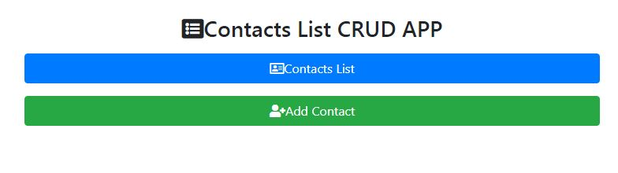
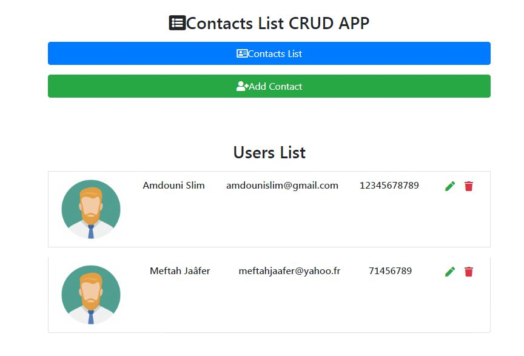
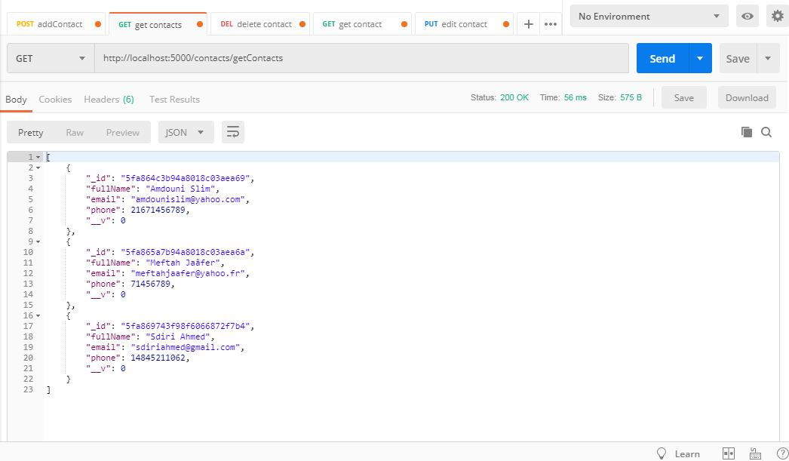
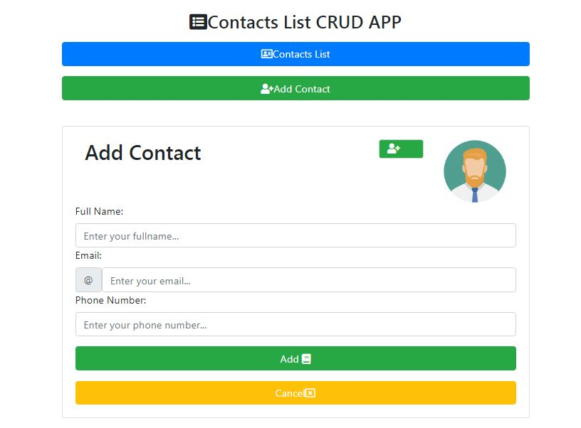
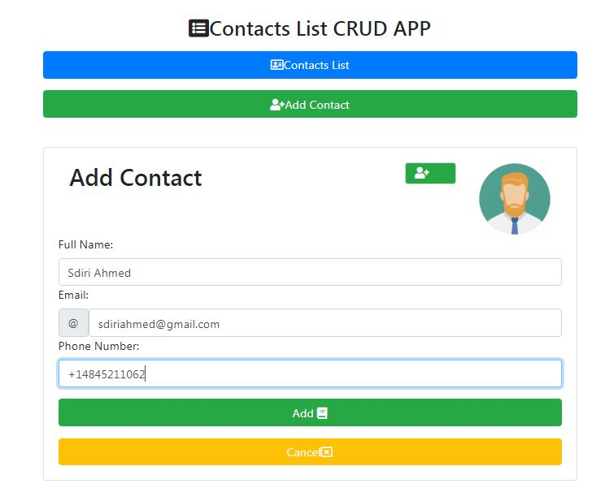
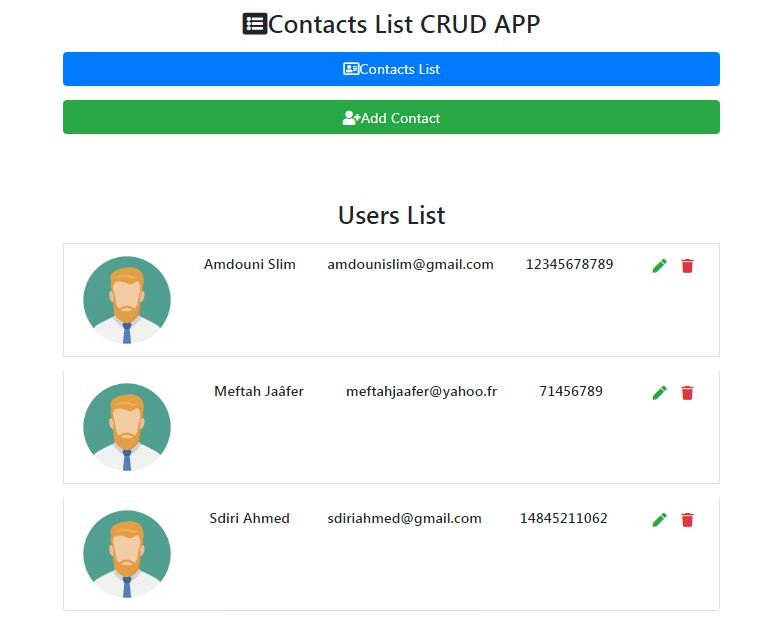
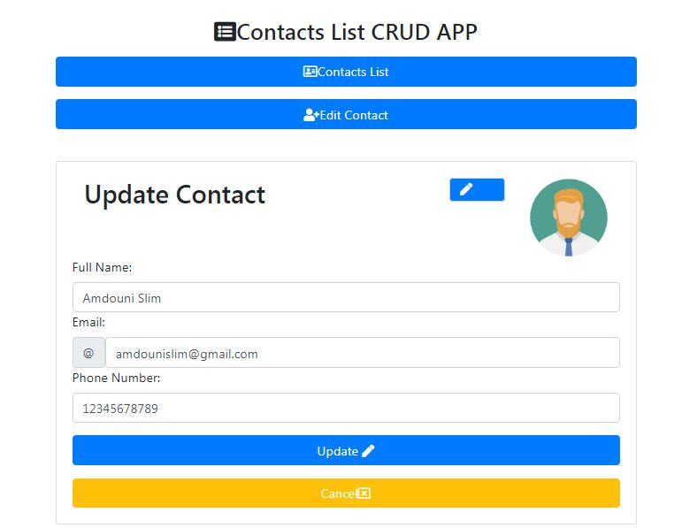
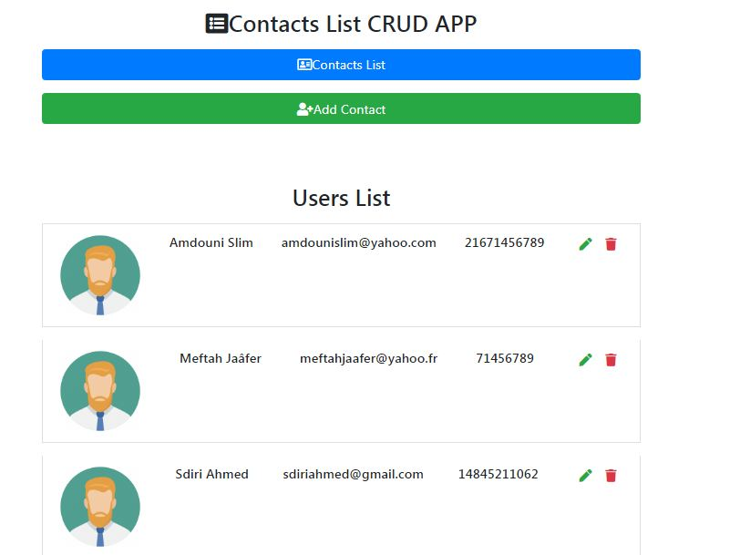
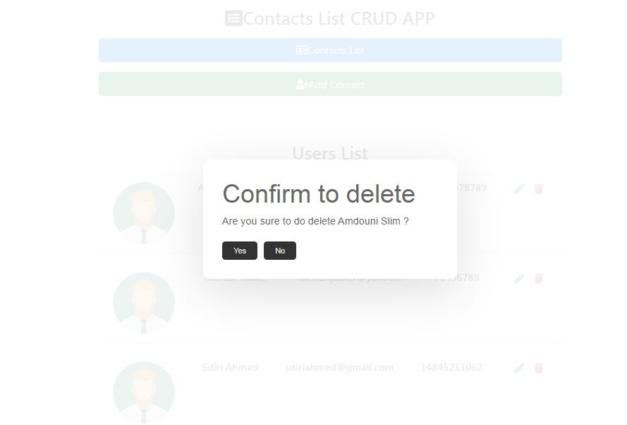

## Objectives

In this Simple project, we are going to create MERN CRUD APP.

### Screenshots 

##### Home Page

##### Get the Contacts List
- In Browser

- with POSTMAN

##### Add new contact
- Step 1

- Step 2

- Step 3

##### Update contact
- Step 1

- Step 2

##### Delete contact
- Using "react-confirm-alert" package

